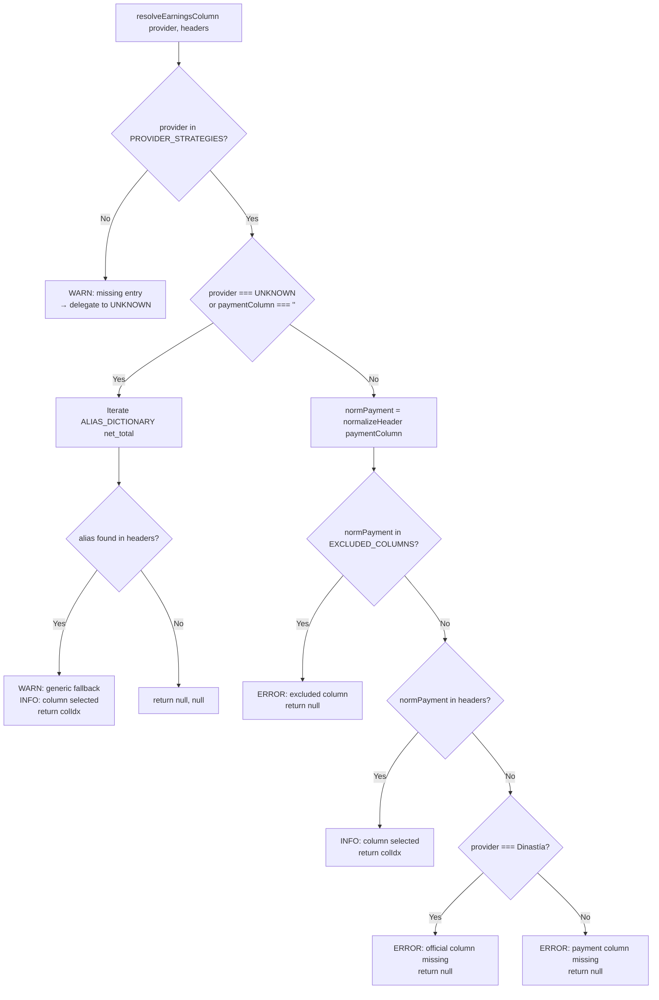

# Design Document — payment-column-strategy

## Overview

Este feature reemplaza la lógica de selección de columna de pago basada en listas candidatas
(`earningsCandidates`) por una configuración determinista de columna única por distribuidora
(`paymentColumn`). Agrega un módulo de agrupamiento por moneda (`CurrencyGrouper`), un cliente
de tasas de cambio bajo demanda (`CurrencyConverter`), una nueva pestaña en la UI (`CurrencyTab`),
y la persistencia de los totales por moneda en una tabla de Supabase (`import_currency_summary`).

### Objetivos de diseño

1. **Determinismo**: dado un proveedor y un archivo, la columna de pago seleccionada es siempre
   la misma — sin fallbacks automáticos ni heurísticas de candidatos.
2. **Compatibilidad hacia atrás**: `RUPEResult`, `ParsedRow`, `AuditReport`, `DebugSnapshot` y
   la firma de `resolveEarningsColumn` no cambian.
3. **Extensibilidad**: añadir una nueva distribuidora solo requiere una línea en
   `PROVIDER_STRATEGIES`; el motor la consume automáticamente.
4. **Precisión Decimal(20,8)**: todos los acumulados monetarios usan `DecimalAccumulator` existente.
5. **Privacidad de datos**: la API de tasas de cambio solo se invoca cuando el usuario hace clic
   en "Convertir Totales"; nunca durante el parseo.

---

## Architecture

El feature se organiza en cinco capas, cada una con responsabilidad única:

```
┌─────────────────────────────────────────────────────────┐
│  UI Layer                                               │
│  CurrencyTab.tsx   UploadPage.tsx (extensión)          │
└───────────────────────────┬─────────────────────────────┘
                            │ stats.currencyGroups
┌───────────────────────────▼─────────────────────────────┐
│  Engine Layer                                           │
│  ProviderStrategy.ts  ──►  PaymentColumnResolver        │
│  CurrencyGrouper.ts                                     │
│  CurrencyConverter.ts (solo on-demand)                  │
└───────────────────────────┬─────────────────────────────┘
                            │ ParsedRow[], CurrencyGroup[]
┌───────────────────────────▼─────────────────────────────┐
│  Persistence Layer                                      │
│  UploadPage.tsx → supabase.from('import_currency_summary')│
└─────────────────────────────────────────────────────────┘
```

### Flujo de procesamiento completo

```
File drop
  │
  ▼
UniversalParser.parseFile()
  │
  ├─► detectProvider()            → ProviderName
  ├─► resolveEarningsColumn()     → { colIdx, fieldUsed }   ← MODIFICADO
  │     └─► PaymentColumnResolver (lógica interna nueva)
  ├─► CurrencyGrouper.group()     → CurrencyGroup[]         ← NUEVO
  │     └─► per-group DecimalAccumulator
  ├─► computeStats()              → RUPEStats (+ currencyGroups) ← EXTENDIDO
  │
  ▼
UploadPage.processFile()
  ├─► insert royalty_records (sin cambios)
  ├─► insert import_currency_summary (NUEVO)
  └─► setStats() → render CurrencyTab (NUEVO)
```

---

## Components and Interfaces

### 1. `ProviderStrategy.ts` — modificaciones

#### 1a. Tipo `ProviderName` extendido

Se agrega `'Dinastía'` y se renombran los DSPs directos para distinguirlos de los genéricos V1:

```typescript
export type ProviderName =
  | 'Dinastía'            // NEW
  | 'Ditto'
  | 'DistroKid'
  | 'TuneCore'
  | 'ONErpm'
  | 'Believe'
  | 'CD Baby'
  | 'Symphonic'
  | 'UnitedMasters'
  | 'FUGA'
  | 'RouteNote'
  | 'Too Lost'
  | 'Amuse'
  | 'Spotify Direct'      // NEW (was 'Spotify')
  | 'Apple Music Reports' // NEW (was 'Apple Music')
  | 'Amazon Music Reports'// NEW (was 'Amazon Music')
  | 'Tidal Reports'       // NEW (was 'Tidal')
  | 'YouTube Content ID'  // NEW (was 'YouTube')
  | 'TikTok'
  | 'Meta'
  | 'UNKNOWN'
```

Los nombres V1 (`Spotify`, `Apple Music`, `Amazon Music`, `Tidal`, `YouTube`) se mantienen en el
tipo unión para compatibilidad si existen archivos en DB con esos valores, pero `PROVIDER_STRATEGIES`
solo define entradas para los nuevos nombres. `ProviderDetector.ts` se actualiza para emitir los
nuevos nombres.

#### 1b. `ProviderStrategyEntry` — campo nuevo `paymentColumn`

```typescript
export interface ProviderStrategyEntry {
  /**
   * Pre-normalization name of the single payment column for this provider.
   * PaymentColumnResolver normalizes this with normalizeHeader() before lookup.
   * No fallbacks — if this column is absent, resolution returns null.
   */
  paymentColumn: string

  /**
   * Default ISO currency code when no currency column is detected in the file.
   * Optional: defaults to 'USD' when absent.
   */
  defaultCurrency?: string

  /**
   * @deprecated V1 field kept for backward compat with existing tests.
   * resolveEarningsColumn() now delegates to paymentColumn internally.
   * Will be removed in a future cleanup pass.
   */
  earningsCandidates?: string[]

  /** @deprecated V1 secondary field for Ditto. Ignored by new resolver. */
  secondaryField?: string
}
```

#### 1c. `PROVIDER_STRATEGIES` tabla actualizada

```typescript
export const PROVIDER_STRATEGIES: Record<ProviderName, ProviderStrategyEntry> = {
  'Dinastía':             { paymentColumn: 'net_total_client_currency', defaultCurrency: 'COP' },
  'Ditto':                { paymentColumn: 'net_total',                 defaultCurrency: 'USD',
                            earningsCandidates: ['nettotal'], secondaryField: 'currencynettotal' },
  'DistroKid':            { paymentColumn: 'earnings',                  defaultCurrency: 'USD',
                            earningsCandidates: ['netearnings', 'royaltyamount', 'payment'] },
  'TuneCore':             { paymentColumn: 'net_revenue',               defaultCurrency: 'USD',
                            earningsCandidates: ['netrevenue', 'royaltyamount', 'netamount'] },
  'ONErpm':               { paymentColumn: 'net_revenue',               defaultCurrency: 'USD',
                            earningsCandidates: ['netrevenue', 'amount', 'royalty'] },
  'Believe':              { paymentColumn: 'net_amount',                defaultCurrency: 'EUR',
                            earningsCandidates: ['netamount', 'royalty'] },
  'CD Baby':              { paymentColumn: 'net_payable',               defaultCurrency: 'USD',
                            earningsCandidates: ['netpayable', 'netearnings'] },
  'Symphonic':            { paymentColumn: 'net_revenue',               defaultCurrency: 'USD',
                            earningsCandidates: ['netrevenue'] },
  'UnitedMasters':        { paymentColumn: 'royalty',                   defaultCurrency: 'USD',
                            earningsCandidates: ['royaltyamount'] },
  'FUGA':                 { paymentColumn: 'royalty_amount',            defaultCurrency: 'USD',
                            earningsCandidates: ['royaltyamount'] },
  'RouteNote':            { paymentColumn: 'net_amount',                defaultCurrency: 'USD',
                            earningsCandidates: ['netamount'] },
  'Too Lost':             { paymentColumn: 'royalty',                   defaultCurrency: 'USD',
                            earningsCandidates: ['netrevenue', 'royalty'] },
  'Amuse':                { paymentColumn: 'net_revenue',               defaultCurrency: 'USD',
                            earningsCandidates: ['netrevenue'] },
  'Spotify Direct':       { paymentColumn: 'royalties',                 defaultCurrency: 'USD',
                            earningsCandidates: ['royalty', 'revenue'] },
  'Apple Music Reports':  { paymentColumn: 'royalty',                   defaultCurrency: 'USD',
                            earningsCandidates: ['royalty', 'netamount'] },
  'Amazon Music Reports': { paymentColumn: 'royalty',                   defaultCurrency: 'USD',
                            earningsCandidates: ['royalty'] },
  'Tidal Reports':        { paymentColumn: 'royalty',                   defaultCurrency: 'USD',
                            earningsCandidates: ['royalty'] },
  'YouTube Content ID':   { paymentColumn: 'partner_revenue',           defaultCurrency: 'USD',
                            earningsCandidates: ['partnerrevenue', 'netrevenue', 'royalty'] },
  'TikTok':               { paymentColumn: 'royalty',                   defaultCurrency: 'USD',
                            earningsCandidates: ['royalty', 'netrevenue'] },
  'Meta':                 { paymentColumn: 'revenue',                   defaultCurrency: 'USD',
                            earningsCandidates: ['royalty', 'netrevenue'] },
  'UNKNOWN':              { paymentColumn: '',                          defaultCurrency: 'USD',
                            earningsCandidates: ['nettotal', 'royalty', 'netrevenue', 'netearnings', 'netamount'] },
}
```

**Decisión de diseño**: `UNKNOWN` tiene `paymentColumn: ''` (vacío). `PaymentColumnResolver` trata
`paymentColumn === ''` como señal para usar el path de aliases de `ALIAS_DICTIONARY['net_total']`,
preservando el comportamiento V1 exactamente.

### 2. `PaymentColumnResolver` — función dentro de `ProviderStrategy.ts`

Esta función **reemplaza la lógica interna** de `resolveEarningsColumn()` pero mantiene su firma
pública idéntica para backward compat:

```typescript
// Firma pública — SIN CAMBIOS (Req 11.2)
export function resolveEarningsColumn(
  provider: ProviderName,
  normalizedHeaders: string[],
  logger: Logger,
): { colIdx: number | null; fieldUsed: string | null }
```

#### Algoritmo de resolución

```
resolveEarningsColumn(provider, normalizedHeaders, logger):

  strategy = PROVIDER_STRATEGIES[provider]

  // Guard: provider not in table (future-proofing)
  IF strategy is undefined:
    logger.warn(`Proveedor "${provider}" no encontrado en PROVIDER_STRATEGIES; usando UNKNOWN`)
    return resolveEarningsColumn('UNKNOWN', normalizedHeaders, logger)

  // Path 1: UNKNOWN — iterate ALIAS_DICTIONARY['net_total'] (backward compat)
  IF provider === 'UNKNOWN' OR strategy.paymentColumn === '':
    FOR alias IN ALIAS_DICTIONARY['net_total']:
      normAlias = normalizeHeader(alias)
      IF normAlias IN EXCLUDED_COLUMNS: continue
      idx = normalizedHeaders.indexOf(normAlias)
      IF idx !== -1:
        logger.warn('estrategia genérica en uso')
        logger.info(`Columna seleccionada: ${normalizedHeaders[idx]} (UNKNOWN alias)`)
        return { colIdx: idx, fieldUsed: alias }
    return { colIdx: null, fieldUsed: null }

  // Path 2: Known provider — single paymentColumn lookup
  normPayment = normalizeHeader(strategy.paymentColumn)

  // Safety: never return an EXCLUDED column
  IF normPayment IN EXCLUDED_COLUMNS:
    logger.error(`paymentColumn "${strategy.paymentColumn}" está en EXCLUDED_COLUMNS`)
    return { colIdx: null, fieldUsed: null }

  idx = normalizedHeaders.indexOf(normPayment)

  IF idx !== -1:
    logger.info(`Columna de pago: ${normalizedHeaders[idx]} (proveedor: ${provider})`)
    return { colIdx: idx, fieldUsed: strategy.paymentColumn }

  // Column not found
  IF provider === 'Dinastía':
    logger.error(`Columna oficial de Dinastía "net_total_client_currency" no encontrada`)
  ELSE:
    logger.error(`Columna de pago "${strategy.paymentColumn}" no encontrada para ${provider}`)

  return { colIdx: null, fieldUsed: null }
```

#### Manejo especial de Dinastía en `UniversalParser.ts`

Cuando `resolveEarningsColumn` retorna `{ colIdx: null }` para el proveedor `Dinastía`,
`UniversalParser.parseFile()` lanza un error antes de iniciar el loop de filas:

```typescript
if (provider === 'Dinastía' && earningsColIdx === null) {
  throw new Error(
    'Reporte de Dinastía: columna "net_total_client_currency" no encontrada. ' +
    'Verifica que el archivo contenga esta columna antes de procesar.'
  )
}
```

### 3. `ProviderDetector.ts` — agregar Dinastía y renombrar DSPs

Se agrega una nueva entrada al array `PROVIDERS` **antes** de los DSPs genéricos para que el
tiebreak por posición funcione correctamente:

```typescript
{ name: 'Dinastía',             signals: ['dinastia', 'nettotalclientcurrency', 'clientcurrency'] },
// DSPs directos renombrados:
{ name: 'Spotify Direct',       signals: ['spotifydirect'] },
{ name: 'Apple Music Reports',  signals: ['applemusicreports', 'applemusic'] },
{ name: 'Amazon Music Reports', signals: ['amazonmusicreports', 'amazonmusic'] },
{ name: 'Tidal Reports',        signals: ['tidalreports', 'tidal'] },
{ name: 'YouTube Content ID',   signals: ['youtubecontentid', 'youtube', 'contentid', 'partnerrevenue'] },
```

Los nombres V1 se eliminan del array `PROVIDERS` (no del tipo unión) para evitar que archivos
nuevos de esos proveedores sean detectados con los nombres genéricos.

---

### 4. `CurrencyGrouper.ts` — nuevo módulo

**Ubicación**: `src/royalty-engine/CurrencyGrouper.ts`

```typescript
import { DecimalAccumulator } from './DecimalAccumulator'
import { normalizeHeader } from './HeaderNormalizer'
import type { ParsedRow } from './UniversalParser'
import type { Logger } from './Logger'
import { PROVIDER_STRATEGIES, type ProviderName } from './ProviderStrategy'

/** Currency candidates in priority order (all post-normalization). */
const CURRENCY_CANDIDATES = [
  'currency', 'currencycode', 'clientcurrency', 'paymentcurrency', 'settlementcurrency',
]

const SYMBOL_MAP: Record<string, string> = { '$': 'USD', '€': 'EUR', '£': 'GBP' }

const KNOWN_CODES = new Set([
  'USD', 'EUR', 'GBP', 'CAD', 'AUD', 'JPY', 'MXN', 'COP', 'BRL', 'CHF', 'SEK', 'NOK', 'DKK',
])

export interface CurrencyGroup {
  currency:    string   // ISO code, e.g. 'USD'
  total:       number   // DecimalAccumulator.toNumber()
  totalFixed8: string   // DecimalAccumulator.toFixed8() for DB storage
  recordCount: number
  percentage:  number   // (groupTotal / globalTotal) * 100, full precision
}

export interface CurrencyGrouperResult {
  groups:         CurrencyGroup[]
  currencyColIdx: number | null  // index of detected currency column, or null
}
```

#### Función principal

```typescript
export function groupByCurrency(
  rows: ParsedRow[],
  rawHeaders: string[],
  provider: ProviderName,
  logger: Logger,
): CurrencyGrouperResult

/**
 * Algorithm:
 *
 * 1. Detect currency column index
 *    normalizedHeaders = normalizeHeaders(rawHeaders)
 *    FOR candidate IN CURRENCY_CANDIDATES:
 *      idx = normalizedHeaders.indexOf(candidate)
 *      IF idx !== -1: currencyColIdx = idx; break
 *
 *    IF currencyColIdx is null:
 *      defaultCurrency = PROVIDER_STRATEGIES[provider]?.defaultCurrency ?? 'USD'
 *      IF strategy has no defaultCurrency:
 *        logger.warn('No se detectó columna de moneda; usando USD por defecto')
 *
 * 2. Resolve per-row currency code
 *    FOR each row IN rows:
 *      rawVal = currencyColIdx !== null ? rawHeaders[currencyColIdx from row cell] : ''
 *      // Actually: rows[i].currency is already populated by extractRow()
 *      // Use row.currency if not empty; otherwise use defaultCurrency
 *      resolved = resolveCode(row.currency, defaultCurrency, logger, rowIndex)
 *
 * 3. Group accumulation
 *    accumulators: Map<string, DecimalAccumulator>
 *    counts: Map<string, number>
 *    FOR each row, resolved currency:
 *      IF !accumulators.has(resolved): accumulators.set(resolved, new DecimalAccumulator())
 *      accumulators.get(resolved).add(row.net_total)
 *      counts.set(resolved, (counts.get(resolved) ?? 0) + 1)
 *
 * 4. Compute global total
 *    globalAcc = new DecimalAccumulator()
 *    FOR each acc IN accumulators.values(): globalAcc.add(acc.toNumber())
 *    globalTotal = globalAcc.toNumber()
 *
 * 5. Build CurrencyGroup[]
 *    FOR each [currency, acc] IN accumulators:
 *      total = acc.toNumber()
 *      percentage = globalTotal > 0 ? (total / globalTotal) * 100 : 0
 *      groups.push({ currency, total, totalFixed8: acc.toFixed8(),
 *                    recordCount: counts.get(currency), percentage })
 *
 * 6. Sort descending by total
 *    groups.sort((a, b) => b.total - a.total)
 *
 * 7. Return { groups, currencyColIdx }
 */
```

**Decisión de diseño**: `groupByCurrency` recibe `ParsedRow[]` (post-extracción), no las raw
string rows. Esto es posible porque `extractRow()` ya popula `row.currency` desde la columna
detectada por `ColumnMapper`. El `CurrencyGrouper` usa `row.currency` directamente, evitando
re-parseo de raw cells. Si la columna de moneda no fue detectada por `ColumnMapper`, `row.currency`
contiene el `currency` global del archivo (del `CurrencyDetector`), que sirve como fallback.

**Nota importante**: `groupByCurrency` solo usa `row.net_total` (el campo ya acumulado por la
selección de `PaymentColumnResolver`). No re-lee el archivo; trabaja sobre las `ParsedRow[]`
ya extraídas por `UniversalParser`.

---

### 5. `Statistics.ts` — extensión de `RUPEStats`

Se agrega `currencyGroups` a la interfaz:

```typescript
export interface RUPEStats {
  // ... todos los campos V1/V2 existentes sin cambios ...

  // ── payment-column-strategy additions ─────────────────────────────────────
  /** Currency breakdown from CurrencyGrouper. Empty array if not computed. */
  currencyGroups: CurrencyGroup[]
  /** Column name (pre-normalization) used for payment accumulation. */
  paymentColumnUsed: string
}
```

`computeStats()` recibe dos parámetros nuevos opcionales con defaults para backward compat:

```typescript
export function computeStats(
  rows: ParsedRow[],
  currency: string,
  provider: string,
  log: string[],
  errors: number,
  auditStatus: 'valid' | 'discrepancy' | 'error' = 'valid',
  processingTimeMs: number = 0,
  currencyGroups: CurrencyGroup[] = [],        // NEW, default []
  paymentColumnUsed: string = '',              // NEW, default ''
): RUPEStats
```

---

### 6. `CurrencyConverter.ts` — nuevo módulo

**Ubicación**: `src/royalty-engine/CurrencyConverter.ts`

**API elegida**: `open.er-api.com` (Exchange Rates API — free tier, sin clave API, HTTPS, CORS
habilitado para browsers). Endpoint: `https://open.er-api.com/v6/latest/{baseCurrency}`.

**Decisión de diseño**: se elige `open.er-api.com` sobre `exchangerate-api.com` porque su free
tier no requiere registro ni API key, lo que elimina la necesidad de gestionar secrets en Vite.

```typescript
export type TargetCurrency = 'USD' | 'EUR' | 'COP' | 'GBP' | 'MXN' | 'CAD' | 'JPY'

export interface ConversionResult {
  targetCurrency: TargetCurrency
  groups: Array<{
    currency:        string
    originalTotal:   number
    convertedTotal:  number
    rate:            number
  }>
}

/**
 * Fetches exchange rates for all source currencies in `groups` and returns
 * converted totals.
 *
 * Strategy:
 *   - Make ONE request: GET /v6/latest/USD (always USD as base)
 *   - Derive all rates: rate = rates[target] / rates[source]
 *   - If source === target: rate = 1.0
 *   - Timeout: 10 seconds (AbortController)
 *
 * Throws on network error, non-200 response, or timeout.
 * Never called during file parsing — only on explicit user action.
 */
export async function convertCurrencies(
  groups: CurrencyGroup[],
  targetCurrency: TargetCurrency,
  signal?: AbortSignal,
): Promise<ConversionResult>
```

**Decisión de diseño sobre el endpoint**: se hace UNA sola petición con base USD y se derivan
todas las tasas cruzadas en el cliente. Esto minimiza latencia y evita múltiples round-trips
incluso cuando hay varias monedas origen.

---

### 7. `CurrencyTab.tsx` — nuevo componente UI

**Ubicación**: `src/components/CurrencyTab.tsx`

```typescript
interface CurrencyTabProps {
  groups: CurrencyGroup[]
  // Callback to parent when user requests conversion
  onConvert: (target: TargetCurrency) => Promise<void>
  // Conversion state from parent
  converting: boolean
  conversionResult: ConversionResult | null
  conversionError: string | null
}
```

#### Layout de la pestaña

```
┌─────────────────────────────────────────────────────┐
│  [Selector: USD | EUR | COP | GBP | MXN | CAD | JPY]│
│  [Convertir Totales]  ← disabled while converting   │
├─────────────────────────────────────────────────────┤
│  ┌──────────────┐  ┌──────────────┐                 │
│  │  USD         │  │  EUR         │                 │
│  │  $ 1,234.56  │  │  € 987.65    │                 │
│  │  1,200 rows  │  │  300 rows    │                 │
│  │  80.00 %     │  │  20.00 %     │                 │
│  │  ───────     │  │  ───────     │                 │
│  │  ≈ USD 1,234 │  │  ≈ USD 1,050 │  (post-convert) │
│  └──────────────┘  └──────────────┘                 │
└─────────────────────────────────────────────────────┘
```

Cada tarjeta muestra:
- Badge con el código de moneda
- Total formateado con 2 decimales
- Cantidad de registros
- Porcentaje con 2 decimales + "%"
- Tras conversión: total convertido con código destino


### 8. `UploadPage.tsx` — integración

#### Estado nuevo

```typescript
const [activeTab, setActiveTab] = useState<'audit' | 'currencies'>('audit')
const [converting, setConverting] = useState(false)
const [conversionResult, setConversionResult] = useState<ConversionResult | null>(null)
const [conversionError, setConversionError] = useState<string | null>(null)
```

#### Renderizado condicional de tabs

En los estados `success` y `discrepancy`, si `stats.currencyGroups.length > 0`:

```tsx
<div className="flex gap-1 mb-4">
  <TabButton active={activeTab === 'audit'} onClick={() => setActiveTab('audit')}>
    Auditoría
  </TabButton>
  <TabButton active={activeTab === 'currencies'} onClick={() => setActiveTab('currencies')}>
    Monedas
    <span className="badge-neutral ml-1">{stats.currencyGroups.length}</span>
  </TabButton>
</div>

{activeTab === 'audit'      && <AuditSummary ... />}
{activeTab === 'currencies' && (
  <CurrencyTab
    groups={stats.currencyGroups}
    onConvert={handleConvert}
    converting={converting}
    conversionResult={conversionResult}
    conversionError={conversionError}
  />
)}
```

#### Handler `handleConvert`

```typescript
const handleConvert = async (target: TargetCurrency) => {
  if (!stats || converting) return
  setConverting(true)
  setConversionError(null)
  try {
    const result = await convertCurrencies(stats.currencyGroups, target)
    setConversionResult(result)
  } catch {
    setConversionError('Error al obtener tasas de cambio. Intenta de nuevo.')
  } finally {
    setConverting(false)
  }
}
```

#### Persistencia en `processFile()`

Después del step 5 (mark complete), antes del activity log:

```typescript
// 5b. Save currency summary (Req 9)
if (parsedStats.currencyGroups.length > 0) {
  try {
    const summaryRows = parsedStats.currencyGroups.map(g => ({
      report_id:           report.id,
      user_id:             user.id,
      distributor:         parsedStats.provider,
      currency:            g.currency,
      payment_column_used: parsedStats.paymentColumnUsed,
      total_by_currency:   g.totalFixed8,
      record_count:        g.recordCount,
    }))
    const { error: summaryErr } = await db
      .from('import_currency_summary')
      .insert(summaryRows)
    if (summaryErr) {
      console.error(`[ERROR] import_currency_summary insert failed: ${summaryErr.message}`)
    }
  } catch (err) {
    console.error('[ERROR] import_currency_summary unexpected error:', err)
    // Intentionally NOT re-thrown — does not fail the main flow (Req 9.3)
  }
}
```

---

## Data Models

### `CurrencyGroup`

| Campo | Tipo | Descripción |
|-------|------|-------------|
| `currency` | `string` | ISO-4217 code (e.g. `'USD'`) |
| `total` | `number` | `DecimalAccumulator.toNumber()` para comparaciones |
| `totalFixed8` | `string` | `DecimalAccumulator.toFixed8()` para DB / display preciso |
| `recordCount` | `number` | Integer, número de filas en el grupo |
| `percentage` | `number` | `(groupTotal / globalTotal) * 100`, precisión completa |

### `ConversionResult`

| Campo | Tipo | Descripción |
|-------|------|-------------|
| `targetCurrency` | `TargetCurrency` | Moneda destino de la conversión |
| `groups[].currency` | `string` | Moneda origen del grupo |
| `groups[].originalTotal` | `number` | Total antes de conversión |
| `groups[].convertedTotal` | `number` | `originalTotal * rate` |
| `groups[].rate` | `number` | Tasa aplicada |

### Tabla `import_currency_summary`

```sql
CREATE TABLE IF NOT EXISTS public.import_currency_summary (
  id                   UUID         PRIMARY KEY DEFAULT uuid_generate_v4(),
  report_id            UUID         NOT NULL
                         REFERENCES public.reports(id) ON DELETE CASCADE,
  user_id              UUID         NOT NULL
                         REFERENCES public.profiles(id) ON DELETE CASCADE,
  distributor          TEXT         NOT NULL CHECK (char_length(distributor) <= 100),
  currency             TEXT         NOT NULL CHECK (char_length(currency) <= 10),
  payment_column_used  TEXT         NOT NULL CHECK (char_length(payment_column_used) <= 100),
  total_by_currency    NUMERIC(20,8) NOT NULL DEFAULT 0,
  record_count         INTEGER      NOT NULL DEFAULT 0,
  import_date          TIMESTAMPTZ  NOT NULL DEFAULT now()
);
```

### Extensiones a `RUPEStats`

| Campo nuevo | Tipo | Default |
|-------------|------|---------|
| `currencyGroups` | `CurrencyGroup[]` | `[]` |
| `paymentColumnUsed` | `string` | `''` |

---

## Correctness Properties

*A property is a characteristic or behavior that should hold true across all valid executions of a
system — essentially, a formal statement about what the system should do. Properties serve as the
bridge between human-readable specifications and machine-verifiable correctness guarantees.*

### Property 1: Cada proveedor tiene exactamente un `paymentColumn`

*For any* `ProviderName` key present in `PROVIDER_STRATEGIES`, the `paymentColumn` field SHALL be
a non-empty string (except `UNKNOWN` which uses `''` as sentinel for alias-fallback path).

**Validates: Requirements 1.1**

### Property 2: `PaymentColumnResolver` encuentra la columna cuando está presente

*For any* known provider (not `UNKNOWN`) and *any* set of normalized headers that includes the
normalized form of `strategy.paymentColumn`, `resolveEarningsColumn` SHALL return a `colIdx`
equal to the index of that column in the headers array, regardless of position.

**Validates: Requirements 2.1, 2.2**

### Property 3: `PaymentColumnResolver` retorna null cuando la columna no está

*For any* known provider (not `UNKNOWN`) and *any* set of normalized headers that does NOT include
the normalized form of `strategy.paymentColumn`, `resolveEarningsColumn` SHALL return
`{ colIdx: null }`.

**Validates: Requirements 2.3, 3.2, 3.4**

### Property 4: Dinastía nunca usa columna sustituta

*For any* normalized header set passed to `resolveEarningsColumn` with provider `'Dinastía'` that
does not contain `'nettotalclientcurrency'`, the result SHALL always be `{ colIdx: null }` —
regardless of whether other money-like columns (`nettotal`, `grosstotal`, `earnings`, or any alias
in `ALIAS_DICTIONARY['net_total']`) are present.

**Validates: Requirements 3.2, 3.4**

### Property 5: Acumulación por moneda produce totales correctos

*For any* list of `ParsedRow[]` where each row has a known `currency` and a `net_total`,
`groupByCurrency` SHALL produce `CurrencyGroup[]` such that for every distinct currency code `c`,
`group.total` equals the arithmetic sum of `net_total` for all rows with that currency.

**Validates: Requirements 6.1, 6.2**

### Property 6: La suma de todos los grupos es igual al total global

*For any* list of `ParsedRow[]`, the sum of all `group.total` values in the `CurrencyGroup[]`
returned by `groupByCurrency` SHALL equal `stats.totalNet` (within `1e-8` precision).

**Validates: Requirements 6.2, 6.3**

### Property 7: `percentage` suma 100 (o 0 cuando todo es cero)

*For any* non-empty `CurrencyGroup[]` where `globalPaymentTotal > 0`, the sum of all
`group.percentage` values SHALL equal `100.0` (within `1e-8` floating-point tolerance).
When `globalPaymentTotal === 0`, all `percentage` values SHALL be `0`.

**Validates: Requirements 6.2, 6.4**

### Property 8: Orden descendente por total

*For any* `CurrencyGroup[]` returned by `groupByCurrency`, for every pair of adjacent groups
`(groups[i], groups[i+1])`, `groups[i].total >= groups[i+1].total`.

**Validates: Requirements 6.6**

### Property 9: Precisión Decimal(20,8) en acumulación

*For any* list of payment values with up to 8 decimal places, accumulating them with
`DecimalAccumulator` and calling `toFixed8()` SHALL produce a string identical to the exact
arithmetic sum truncated/rounded at 8 decimal places — no floating-point drift.

**Validates: Requirements 4.1, 4.4**

### Property 10: Celdas no numéricas contribuyen cero al total

*For any* set of rows where a subset has non-numeric or empty payment column values,
the accumulated `DecimalAccumulator` total SHALL equal the sum of only the numeric values —
the non-numeric cells contribute exactly `0` to the total.

**Validates: Requirements 4.5**

---


## Error Handling

### Motor de parseo

| Condición | Comportamiento | Log |
|-----------|---------------|-----|
| Proveedor no encontrado en `PROVIDER_STRATEGIES` | Delegar a `UNKNOWN`, continuar | `[WARN]` |
| `paymentColumn` en `EXCLUDED_COLUMNS` | Retornar `null`, no procesar | `[ERROR]` |
| `paymentColumn` ausente para proveedor no-Dinastía | `audit.status = 'discrepancy'`, total = 0 | `[ERROR]` |
| `paymentColumn` ausente para `Dinastía` | Lanzar `Error` antes del loop, rechazar Promise | `[ERROR]` |
| Celda de pago no numérica | Tratar como `0`, continuar | `[WARN]` por fila |
| Columna de moneda no detectada | Usar `defaultCurrency` del proveedor (o `'USD'`) | `[WARN]` una vez |
| Código de moneda desconocido en fila | Asignar a `defaultCurrency` | `[WARN]` por fila |
| `globalPaymentTotal === 0` | `percentage = 0` para todos los grupos | ninguno |

### `CurrencyConverter` (UI)

| Condición | Comportamiento |
|-----------|---------------|
| Error de red | Mostrar `"Error al obtener tasas de cambio. Intenta de nuevo."` |
| HTTP 4xx / 5xx | Mismo mensaje de error |
| Timeout > 10 segundos | Abortar con `AbortController`, mostrar error |
| Moneda origen === destino | Aplicar tasa `1.0`, sin petición extra |
| Conversión en curso | Botón `disabled`, spinner visible |

### Persistencia (`import_currency_summary`)

- El insert se ejecuta en un `try/catch` separado del flujo principal.
- Si falla, se loguea `[ERROR]` en consola pero NO se lanza ni revierte la inserción del reporte.
- El usuario nunca ve este error en la UI (Req 9.3).

---

## Testing Strategy

### Filosofía

Se usa un enfoque **dual**: property-based tests (PBT) para las 10 propiedades formales definidas
arriba, y unit tests de ejemplo para los comportamientos específicos no cubiertos por PBT (casos
de error, integraciones con Supabase, UI).

PBT es aplicable aquí porque:
- `PaymentColumnResolver`, `CurrencyGrouper`, `DecimalAccumulator` son funciones puras con
  espacio de entrada grande (combinaciones de providers × headers × row values).
- Las propiedades universales (columna única, totales correctos, orden, precisión) se validan
  mejor con 100+ iteraciones que con ejemplos fijos.

**Librería PBT**: `fast-check` — compatible con Vitest, soporta shrinking, sin dependencias
externas adicionales.

```
npm install --save-dev fast-check
```

### Configuración de tests PBT

Cada property test corre mínimo **100 iteraciones** (`numRuns: 100`) y lleva un comentario
de trazabilidad:

```typescript
// Feature: payment-column-strategy, Property 2: PaymentColumnResolver encuentra la columna
fc.assert(fc.property(...), { numRuns: 100 })
```

### Tests de propiedad (`*.test.ts` existentes o nuevos)

**`ProviderStrategy.test.ts`** — Propiedades 1, 2, 3, 4:

```
Property 1: fc.constantFrom(...allProviderNames) → paymentColumn is string
Property 2: fc.record({ provider, colPosition }) → resolver returns colPosition
Property 3: fc.record({ provider, headersWithout }) → resolver returns null
Property 4: fc.array(fc.string()) → Dinastía without 'nettotalclientcurrency' → null
```

**`CurrencyGrouper.test.ts`** — Propiedades 5, 6, 7, 8:

```
Property 5: fc.array(rowArbitrary) → each group.total = sum of rows for that currency
Property 6: fc.array(rowArbitrary) → sum(groups.total) ≈ sum(all rows.net_total)
Property 7: fc.array(rowArbitrary) → sum(percentages) ≈ 100 OR all 0
Property 8: fc.array(rowArbitrary) → groups are sorted descending by total
```

**`DecimalAccumulator.test.ts`** (existente, extender) — Propiedades 9, 10:

```
Property 9: fc.array(fc.float({ min: 0, max: 1e6, noNaN: true })) → precision preserved
Property 10: fc.array(fc.oneof(fc.float(), fc.constant(NaN), fc.constant(0)))
             → accumulated total = sum of finite values only
```

### Unit tests de ejemplo

**`PaymentColumnResolver` — casos edge**:
- Provider no en PROVIDER_STRATEGIES → warning, fallback UNKNOWN
- `paymentColumn` normaliza a EXCLUDED_COLUMNS key → `null`
- Proveedor Dinastía sin columna → null + [ERROR]
- Proveedor UNKNOWN → itera aliases en orden
- `resolveEarningsColumn` backward compat: misma firma, misma salida para UNKNOWN

**`CurrencyConverter` (mockeado)**:
- Petición exitosa → `convertedTotal = originalTotal * rate`
- Timeout 10s → `ConversionError`
- HTTP 500 → `ConversionError`
- Misma moneda origen/destino → rate 1.0

**`CurrencyTab.tsx` (rendering)**:
- Con `groups.length > 0` → renderiza tarjetas
- Con `groups.length === 0` → muestra mensaje de vacío
- Botón disabled durante `converting = true`
- Muestra totales convertidos tras conversión exitosa

**Integration (Supabase, smoke)**:
- Migración SQL es idempotente (ejecutarla dos veces no da error)
- `import_currency_summary` tiene FK a `reports` con `ON DELETE CASCADE`
- Tablas `reports` y `royalty_records` no alteradas por la migración nueva

### Archivos de test a crear o modificar

| Archivo | Tipo | Propiedades |
|---------|------|-------------|
| `src/royalty-engine/ProviderStrategy.test.ts` | PBT + unit | 1, 2, 3, 4 |
| `src/royalty-engine/CurrencyGrouper.test.ts` | PBT + unit | 5, 6, 7, 8 |
| `src/royalty-engine/DecimalAccumulator.test.ts` | PBT (extend) | 9, 10 |
| `src/royalty-engine/CurrencyConverter.test.ts` | unit (mock) | — |
| `src/components/CurrencyTab.test.tsx` | unit (render) | — |


---

## Appendix: SQL Migration

**Archivo**: `supabase/v3-currency-migration.sql`

```sql
-- ============================================================
-- V3 additive migration — payment-column-strategy
-- Adds import_currency_summary table.
-- Requirements: 9
--
-- Safe to run multiple times (IF NOT EXISTS throughout).
-- Does NOT modify reports, royalty_records, or any V1/V2 column.
-- ============================================================

-- Enable UUID extension (idempotent)
CREATE EXTENSION IF NOT EXISTS "uuid-ossp";

-- ------------------------------------------------------------
-- Create import_currency_summary
-- ------------------------------------------------------------
CREATE TABLE IF NOT EXISTS public.import_currency_summary (
  id                   UUID          PRIMARY KEY DEFAULT uuid_generate_v4(),
  report_id            UUID          NOT NULL
                         REFERENCES public.reports(id) ON DELETE CASCADE,
  user_id              UUID          NOT NULL
                         REFERENCES public.profiles(id) ON DELETE CASCADE,
  distributor          TEXT          NOT NULL CHECK (char_length(distributor) <= 100),
  currency             TEXT          NOT NULL CHECK (char_length(currency) <= 10),
  payment_column_used  TEXT          NOT NULL CHECK (char_length(payment_column_used) <= 100),
  total_by_currency    NUMERIC(20,8) NOT NULL DEFAULT 0,
  record_count         INTEGER       NOT NULL DEFAULT 0,
  import_date          TIMESTAMPTZ   NOT NULL DEFAULT now()
);

-- ------------------------------------------------------------
-- Indexes
-- ------------------------------------------------------------
CREATE INDEX IF NOT EXISTS idx_currency_summary_report_id
  ON public.import_currency_summary(report_id);

CREATE INDEX IF NOT EXISTS idx_currency_summary_user_id
  ON public.import_currency_summary(user_id);

CREATE INDEX IF NOT EXISTS idx_currency_summary_currency
  ON public.import_currency_summary(currency);

-- ------------------------------------------------------------
-- Row Level Security
-- ------------------------------------------------------------
ALTER TABLE public.import_currency_summary ENABLE ROW LEVEL SECURITY;

-- SELECT: own rows only
CREATE POLICY IF NOT EXISTS "Users can view own currency summaries"
  ON public.import_currency_summary FOR SELECT
  USING (user_id = auth.uid());

-- INSERT: own rows only
CREATE POLICY IF NOT EXISTS "Users can insert own currency summaries"
  ON public.import_currency_summary FOR INSERT
  WITH CHECK (user_id = auth.uid());
```

**Nota**: `CREATE POLICY IF NOT EXISTS` requiere PostgreSQL 14+. Supabase usa PG15+, por lo que
es seguro. Si se ejecutara en un entorno PG13, habría que usar `DO $$ ... IF NOT EXISTS ... $$`.

---

## Appendix: Mermaid — Flujo de resolución de columna de pago



```mermaid
flowchart TD
    A[groupByCurrency rows, headers, provider] --> B[Detect currency column\nin normalized headers]
    B --> C{currency col found?}
    C -- No --> D[Use provider.defaultCurrency\nor USD]
    C -- Yes --> E[Read row.currency per row]
    D --> F[Group rows by resolved currency]
    E --> F
    F --> G[Per-group DecimalAccumulator.add net_total]
    G --> H[Compute globalTotal = sum of all groups]
    H --> I[Compute percentage for each group]
    I --> J[Sort descending by total]
    J --> K[Return CurrencyGroup[]]
```
