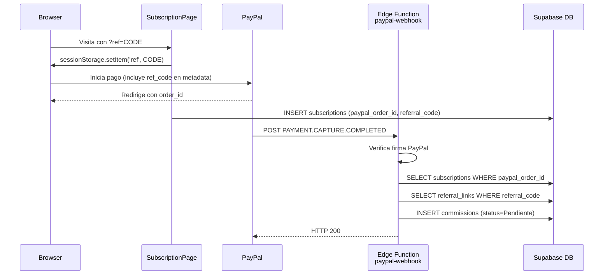
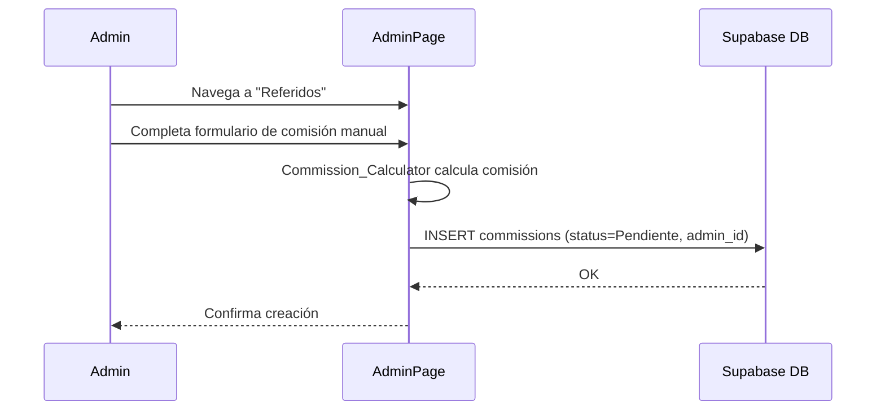
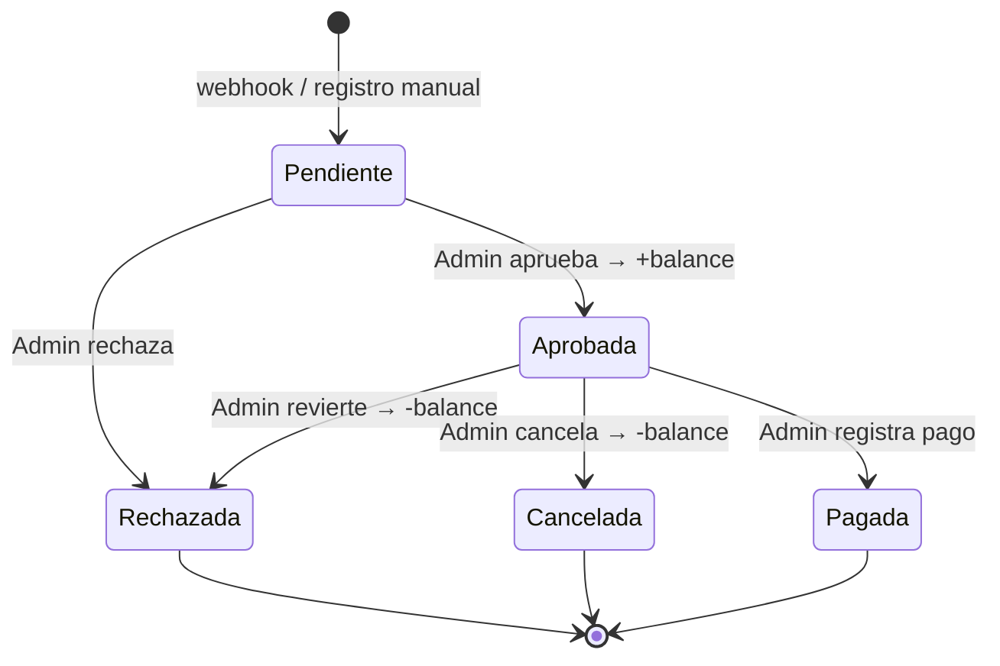

# Design Document — Referral System

## Overview

El sistema de referidos híbrido extiende la aplicación de regalías musicales con un módulo de afiliados de dos canales: procesamiento **automático** vía PayPal webhooks y registro **manual** desde el Admin Panel para métodos como Bold, transferencia bancaria u otros.

Los tres actores principales son:

- **Afiliado**: usuario que comparte su enlace único y acumula comisiones cuando sus referidos compran suscripciones.
- **Comprador**: usuario que llega a la app a través de un enlace de referido y realiza una compra.
- **Administrador**: gestiona el ciclo de vida completo de las comisiones: crear, aprobar, rechazar, editar, pagar y auditar.

El módulo se despliega en el stack existente: **React + TypeScript** (frontend), **Supabase** (PostgreSQL + Auth + RLS + Edge Functions), **Vitest** (tests), y **@tanstack/react-query** para manejo de estado del servidor.

---

## Architecture

### Flujo automático (PayPal)



### Flujo manual (Bold / otros)



### Flujo de aprobación y pago



### Componentes del sistema

```
src/
  pages/
    AdminPage.tsx          ← extiende con sección "Referidos"
    AffiliatePage.tsx      ← nueva vista de afiliado (historial + saldo)
  components/
    referrals/
      CommissionList.tsx
      CommissionForm.tsx
      CommissionEditModal.tsx
      PaymentModal.tsx
      AuditLogDrawer.tsx
      AffiliateBalanceCard.tsx
  hooks/
    useReferralCode.ts     ← lee/guarda sessionStorage
    useCommissions.ts      ← queries React Query
    useCommissionCalculator.ts
  lib/
    commissionCalculator.ts  ← lógica pura de cálculo

supabase/
  referral-system.sql      ← nuevas tablas + RLS + políticas
  functions/
    paypal-webhook/
      index.ts             ← Edge Function
```

---

## Components and Interfaces

### `commissionCalculator.ts`

Módulo puro, sin efectos secundarios.

```typescript
/** Calcula comisión redondeada a 2 decimales */
export function calculateCommission(
  purchaseAmountUsd: number,
  commissionPercentage: number
): number {
  return Math.round(purchaseAmountUsd * (commissionPercentage / 100) * 100) / 100
}
```

### `useReferralCode.ts`

```typescript
export function useReferralCode(): string | null
export function captureReferralCodeFromURL(): void   // lee ?ref=, valida contra DB, guarda en sessionStorage
export function clearReferralCode(): void
```

### `useCommissionCalculator.ts`

Hook React que wrapea `calculateCommission` y gestiona el estado "sobreescrito manualmente".

```typescript
interface UseCommissionCalculatorReturn {
  commission: number
  isManualOverride: boolean
  setManualCommission: (value: number) => void
  resetToCalculated: () => void
}
export function useCommissionCalculator(
  purchaseAmount: number,
  percentage: number
): UseCommissionCalculatorReturn
```

### `useCommissions.ts`

Queries con React Query. Usa la clave `['commissions', filters]` para revalidación optimista.

```typescript
export function useCommissions(filters: CommissionFilters): UseQueryResult<CommissionRow[]>
export function useCreateCommission(): UseMutationResult<...>
export function useUpdateCommission(): UseMutationResult<...>
export function useDeleteCommission(): UseMutationResult<...>
export function useApproveCommission(): UseMutationResult<...>
export function useRejectCommission(): UseMutationResult<...>
export function useMarkCommissionPaid(): UseMutationResult<...>
```

### Edge Function `paypal-webhook`

```typescript
// supabase/functions/paypal-webhook/index.ts
Deno.serve(async (req: Request) => {
  // 1. Verifica firma PAYPAL-TRANSMISSION-SIG
  // 2. Parsea evento PAYMENT.CAPTURE.COMPLETED
  // 3. Idempotencia: verifica si ya existe comisión con paypal_order_id
  // 4. Busca subscription + referral_link
  // 5. Calcula comisión e inserta en commissions
  // 6. Registra en activity_logs
  // Retorna 200 en casos no procesables, 401 solo en firma inválida
})
```

La Edge Function usa el **service role key** internamente para evitar restricciones de RLS en inserciones del sistema.

---

## Data Models

### Nuevas tablas SQL

```sql
-- Tabla de afiliados y sus códigos únicos de referido
CREATE TABLE public.referral_links (
  id              UUID PRIMARY KEY DEFAULT uuid_generate_v4(),
  affiliate_id    UUID NOT NULL REFERENCES public.profiles(id) ON DELETE CASCADE,
  referral_code   TEXT NOT NULL UNIQUE,
  created_at      TIMESTAMPTZ NOT NULL DEFAULT now(),
  is_active       BOOLEAN NOT NULL DEFAULT true
);

CREATE INDEX idx_referral_links_code ON public.referral_links(referral_code);
CREATE INDEX idx_referral_links_affiliate ON public.referral_links(affiliate_id);

-- Saldo disponible por afiliado
CREATE TABLE public.affiliate_balances (
  affiliate_id    UUID PRIMARY KEY REFERENCES public.profiles(id) ON DELETE CASCADE,
  available_balance NUMERIC(12,2) NOT NULL DEFAULT 0 CHECK (available_balance >= 0),
  updated_at      TIMESTAMPTZ NOT NULL DEFAULT now()
);

-- Comisiones
CREATE TABLE public.commissions (
  id                  UUID PRIMARY KEY DEFAULT uuid_generate_v4(),
  affiliate_id        UUID NOT NULL REFERENCES public.profiles(id),
  buyer_id            UUID NOT NULL REFERENCES public.profiles(id),
  purchase_amount_usd NUMERIC(10,2) NOT NULL CHECK (purchase_amount_usd > 0),
  commission_percentage NUMERIC(5,2) NOT NULL CHECK (commission_percentage BETWEEN 0.01 AND 100),
  commission_amount   NUMERIC(10,2) NOT NULL CHECK (commission_amount >= 0),
  status              TEXT NOT NULL DEFAULT 'Pendiente'
                        CHECK (status IN ('Pendiente','Aprobada','Pagada','Rechazada','Cancelada')),
  payment_method      TEXT NOT NULL
                        CHECK (payment_method IN ('PayPal','Bold','Transferencia','Otro')),
  paypal_order_id     TEXT UNIQUE,          -- solo para comisiones automáticas
  admin_id            UUID REFERENCES public.profiles(id),  -- quien creó manualmente
  notes               TEXT,
  -- Datos de pago (se rellena al marcar como Pagada)
  paid_at             TIMESTAMPTZ,
  payment_proof       TEXT,
  payment_notes       TEXT,
  created_at          TIMESTAMPTZ NOT NULL DEFAULT now(),
  updated_at          TIMESTAMPTZ NOT NULL DEFAULT now()
);

CREATE INDEX idx_commissions_affiliate ON public.commissions(affiliate_id);
CREATE INDEX idx_commissions_buyer ON public.commissions(buyer_id);
CREATE INDEX idx_commissions_status ON public.commissions(status);
CREATE INDEX idx_commissions_paypal_order ON public.commissions(paypal_order_id) WHERE paypal_order_id IS NOT NULL;

-- Historial de auditoría (append-only)
CREATE TABLE public.commission_history (
  id            UUID PRIMARY KEY DEFAULT uuid_generate_v4(),
  commission_id UUID NOT NULL REFERENCES public.commissions(id) ON DELETE CASCADE,
  admin_id      UUID NOT NULL REFERENCES public.profiles(id),
  changed_at    TIMESTAMPTZ NOT NULL DEFAULT now(),
  ip_address    INET,
  action        TEXT NOT NULL,   -- 'created','edited','approved','rejected','paid','deleted','cancelled'
  field_changed TEXT,            -- null para acciones de estado
  old_value     TEXT,
  new_value     TEXT,
  reason        TEXT
);

CREATE INDEX idx_commission_history_commission ON public.commission_history(commission_id);
```

### Cambio en `subscriptions`

Se agrega la columna `referral_code` a la tabla existente para que el webhook pueda resolver el afiliado:

```sql
ALTER TABLE public.subscriptions
  ADD COLUMN IF NOT EXISTS referral_code TEXT;
```

### RLS Policies

```sql
-- commissions: solo admins modifican; afiliados leen sus propias
ALTER TABLE public.commissions ENABLE ROW LEVEL SECURITY;

CREATE POLICY "Admins full access on commissions"
  ON public.commissions FOR ALL USING (public.is_admin());

CREATE POLICY "Affiliates read own commissions"
  ON public.commissions FOR SELECT
  USING (affiliate_id = auth.uid());

-- commission_history: admins ven todo; no-admins no ven ip_address (vista)
ALTER TABLE public.commission_history ENABLE ROW LEVEL SECURITY;

CREATE POLICY "Admins full access on history"
  ON public.commission_history FOR ALL USING (public.is_admin());

-- Solo INSERT permitido para roles no-superuser; sin UPDATE/DELETE
-- (Aplicado por ausencia de políticas UPDATE/DELETE para no-admins)

-- affiliate_balances: solo admins modifican; afiliados leen la propia
ALTER TABLE public.affiliate_balances ENABLE ROW LEVEL SECURITY;

CREATE POLICY "Admins full access on balances"
  ON public.affiliate_balances FOR ALL USING (public.is_admin());

CREATE POLICY "Affiliates read own balance"
  ON public.affiliate_balances FOR SELECT
  USING (affiliate_id = auth.uid());

-- referral_links: afiliados leen sus propios; admins ven todo
ALTER TABLE public.referral_links ENABLE ROW LEVEL SECURITY;

CREATE POLICY "Affiliates read own referral links"
  ON public.referral_links FOR SELECT
  USING (affiliate_id = auth.uid() OR public.is_admin());
```

### Función atómica de aprobación

Para garantizar consistencia al actualizar el balance junto con el estado de la comisión, se usa una función SQL con `SECURITY DEFINER`:

```sql
CREATE OR REPLACE FUNCTION approve_commission(p_commission_id UUID, p_admin_id UUID, p_ip INET)
RETURNS VOID AS $$
DECLARE
  v_amount     NUMERIC;
  v_affiliate  UUID;
  v_old_status TEXT;
BEGIN
  SELECT commission_amount, affiliate_id, status
    INTO v_amount, v_affiliate, v_old_status
    FROM commissions WHERE id = p_commission_id FOR UPDATE;

  IF v_old_status = 'Aprobada' THEN
    RAISE EXCEPTION 'already_approved';
  END IF;

  UPDATE commissions SET status = 'Aprobada', updated_at = now() WHERE id = p_commission_id;

  INSERT INTO affiliate_balances (affiliate_id, available_balance)
    VALUES (v_affiliate, v_amount)
    ON CONFLICT (affiliate_id) DO UPDATE
      SET available_balance = affiliate_balances.available_balance + EXCLUDED.available_balance,
          updated_at = now();

  INSERT INTO commission_history (commission_id, admin_id, ip_address, action, old_value, new_value)
    VALUES (p_commission_id, p_admin_id, p_ip, 'approved', v_old_status, 'Aprobada');
END;
$$ LANGUAGE plpgsql SECURITY DEFINER;
```

Una función análoga `reverse_commission_approval` maneja los casos Rechazada/Cancelada con el decremento del balance (`GREATEST(0, balance - amount)`).

### TypeScript Types

```typescript
// src/types/referrals.ts

export type CommissionStatus = 'Pendiente' | 'Aprobada' | 'Pagada' | 'Rechazada' | 'Cancelada'
export type PaymentMethod = 'PayPal' | 'Bold' | 'Transferencia' | 'Otro'

export interface Commission {
  id: string
  affiliate_id: string
  buyer_id: string
  purchase_amount_usd: number
  commission_percentage: number
  commission_amount: number
  status: CommissionStatus
  payment_method: PaymentMethod
  paypal_order_id: string | null
  admin_id: string | null
  notes: string | null
  paid_at: string | null
  payment_proof: string | null
  payment_notes: string | null
  created_at: string
  updated_at: string
  // Joins
  affiliate?: Pick<Profile, 'id' | 'full_name' | 'email'>
  buyer?: Pick<Profile, 'id' | 'full_name' | 'email'>
}

export interface CommissionHistory {
  id: string
  commission_id: string
  admin_id: string
  changed_at: string
  ip_address: string | null   // nunca expuesto a no-admins
  action: string
  field_changed: string | null
  old_value: string | null
  new_value: string | null
  reason: string | null
  admin?: Pick<Profile, 'full_name' | 'email'>
}

export interface AffiliateBalance {
  affiliate_id: string
  available_balance: number
  updated_at: string
}

export interface ReferralLink {
  id: string
  affiliate_id: string
  referral_code: string
  created_at: string
  is_active: boolean
}

export interface CommissionFilters {
  buyerSearch?: string
  affiliateSearch?: string
  status?: CommissionStatus
  page?: number
  pageSize?: number
}
```

---

## Correctness Properties

*A property is a characteristic or behavior that should hold true across all valid executions of a system — essentially, a formal statement about what the system should do. Properties serve as the bridge between human-readable specifications and machine-verifiable correctness guarantees.*

### Property 1: Cálculo de comisión es correcto para cualquier entrada válida

*Para cualquier* monto de compra `p > 0` y porcentaje `c` en `[0.01, 100]`, la función `calculateCommission(p, c)` SHALL producir exactamente `Math.round(p * c / 100 * 100) / 100`.

**Validates: Requirements 1.5, 2.3**

### Property 2: Idempotencia del webhook — sin duplicados

*Para cualquier* `paypal_order_id` dado, si ya existe una comisión registrada con ese ID, procesar el mismo evento nuevamente SHALL dejar el número de comisiones con ese `paypal_order_id` igual a 1.

**Validates: Requirements 1.10**

### Property 3: Validación rechaza entradas inválidas en el formulario manual

*Para cualquier* combinación de entradas donde el monto de compra `≤ 0` o el porcentaje está fuera de `[0.01, 100]`, el sistema SHALL rechazar la inserción y el número de comisiones en BD SHALL permanecer sin cambio.

**Validates: Requirements 2.7, 2.8**

### Property 4: El balance del afiliado sube exactamente la comisión al aprobar

*Para cualquier* comisión en estado `Pendiente` con monto `m`, si un admin la aprueba, el `available_balance` del afiliado SHALL incrementarse exactamente en `m`, sin importar el monto previo del balance.

**Validates: Requirements 6.1**

### Property 5: El balance del afiliado nunca queda negativo

*Para cualquier* secuencia de operaciones de aprobación, cancelación o rechazo sobre comisiones de un afiliado, el `available_balance` del afiliado SHALL ser siempre `≥ 0`.

**Validates: Requirements 6.3, 6.4**

### Property 6: Aprobación doble no duplica el balance

*Para cualquier* comisión ya en estado `Aprobada`, intentar aprobarla nuevamente SHALL dejar el `available_balance` del afiliado sin cambio adicional.

**Validates: Requirements 6.6**

### Property 7: El historial de auditoría captura cada cambio de estado

*Para cualquier* transición de estado de una comisión (crear, aprobar, rechazar, cancelar, pagar, editar), el número de filas en `commission_history` para esa comisión SHALL incrementarse en exactamente 1 por operación.

**Validates: Requirements 8.2**

### Property 8: El filtro de búsqueda es inclusivo y case-insensitive

*Para cualquier* término de búsqueda `q` y lista de comisiones, todos los registros retornados SHALL contener `q` (en minúsculas) en el `full_name` o `email` del campo buscado, y ningún registro que cumpla ese criterio SHALL ser omitido.

**Validates: Requirements 3.2, 3.3**

---

## Error Handling

### Edge Function `paypal-webhook`

| Condición | Acción | HTTP |
|---|---|---|
| Firma inválida | No procesar; retornar error | 401 |
| Evento duplicado (`paypal_order_id` ya existe) | Retornar OK sin inserción | 200 |
| Suscripción no encontrada | Log `webhook_no_subscription` en `activity_logs`; retornar OK | 200 |
| Afiliado no encontrado | Log `webhook_no_affiliate` en `activity_logs`; retornar OK | 200 |
| Error de BD inesperado | Log detallado internamente; retornar 500 (PayPal reintentará) | 500 |

### Frontend

- **Validación client-side** antes de enviar a Supabase: monto > 0, porcentaje en rango, campos requeridos presentes. Los errores se muestran inline junto al campo.
- **Mutaciones optimistas**: no se usan dado que las operaciones de balance requieren consistencia; se usa `invalidateQueries` post-mutación.
- **Errores de red**: capturados en `onError` de React Query, mostrados en un toast o mensaje contextual.
- **Confirmación destructiva**: editar o eliminar una comisión `Pagada` requiere un modal de confirmación explícito.
- **Concurrencia**: la función SQL `approve_commission` usa `SELECT ... FOR UPDATE` para evitar condiciones de carrera al actualizar el balance.

---

## Testing Strategy

### Stack de testing

El proyecto usa **Vitest** (ya configurado). Se usará **fast-check** como librería de property-based testing.

```bash
npm install --save-dev fast-check
```

### Tests unitarios

Ubicados en `src/lib/__tests__/` y junto a los componentes.

- `commissionCalculator.test.ts`: ejemplos concretos de cálculo, bordes (0.01%, 100%, montos con decimales).
- `useCommissionCalculator.test.ts`: verifica override manual y reset.
- `useReferralCode.test.ts`: captura del parámetro `?ref=`, almacenamiento en `sessionStorage`, código inválido ignorado.
- `CommissionForm.test.tsx`: validaciones de formulario con React Testing Library.

### Tests de propiedad (fast-check)

Cada test de propiedad referencia explícitamente la propiedad del diseño con un comentario de tag.

```typescript
// Feature: referral-system, Property 1: Cálculo de comisión es correcto
fc.assert(fc.property(
  fc.float({ min: 0.01, max: 100_000, noNaN: true }),
  fc.float({ min: 0.01, max: 100,     noNaN: true }),
  (amount, pct) => {
    const result = calculateCommission(amount, pct)
    const expected = Math.round(amount * pct / 100 * 100) / 100
    return result === expected
  }
), { numRuns: 100 })
```

Propiedades a cubrir con tests:

| # | Propiedad | Módulo |
|---|---|---|
| 1 | Cálculo correcto para cualquier entrada válida | `commissionCalculator.ts` |
| 2 | Idempotencia del webhook (sin duplicados) | Edge Function (mock Supabase) |
| 3 | Validación rechaza entradas inválidas | `CommissionForm` |
| 4 | Balance sube exactamente al aprobar | `approve_commission` (mock DB) |
| 5 | Balance nunca queda negativo | `reverse_commission_approval` (mock DB) |
| 6 | Aprobación doble no duplica balance | `approve_commission` (mock DB) |
| 7 | Historial captura cada cambio | Mutations hook (mock DB) |
| 8 | Filtro de búsqueda inclusivo y case-insensitive | `useCommissions` filter logic |

### Tests de integración

- Smoke test de la Edge Function con un payload PayPal real (entorno Supabase local con `supabase start`).
- Verificación de políticas RLS: usuario no-admin no puede INSERT/UPDATE/DELETE en `commissions`.
- Verificación de que `commission_history` es append-only: intentar UPDATE o DELETE falla.

### Cobertura mínima esperada

- Lógica pura (`commissionCalculator`): 100%
- Hooks y formularios: ≥ 80%
- Edge Function: cubierta por smoke + property tests con mocks
